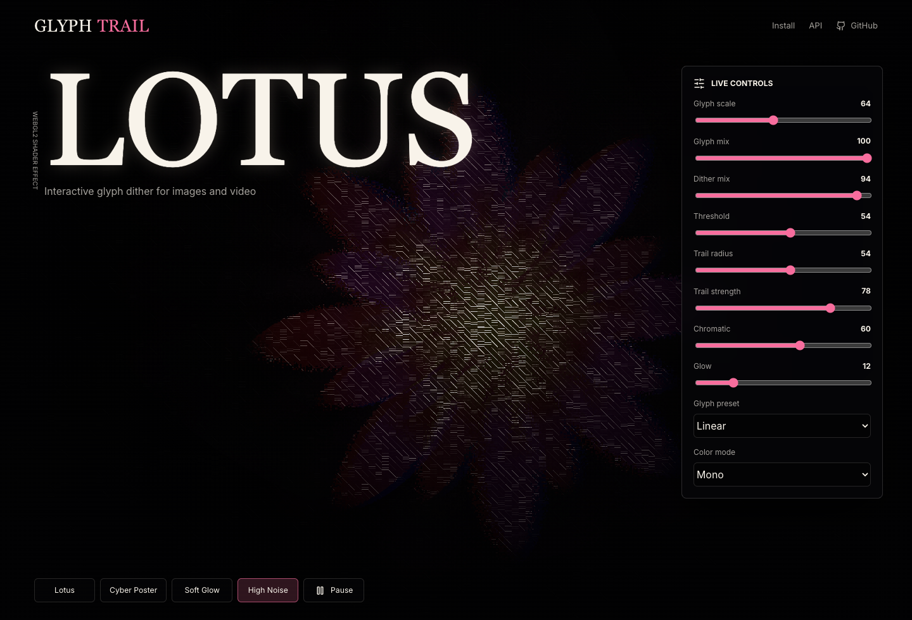

# Glyph Trail

Interactive glyph dither and cursor-displacement effects for images and video.

Glyph Trail is a small Canvas 2D renderer plus a React wrapper that turns image or video sources into interactive pixel-particle artwork. Each cell of the image becomes a square "pixel"; sweeping the cursor drags the pixels along its path slightly in the direction you move — a subtle liquid, dithered flow that keeps each pixel's square shape, then eases back. It is designed for creative hero sections, portfolio pieces, editorial pages, and pixel/dither-art experiments.



## Features

- Framework-agnostic Canvas 2D core — no WebGL required
- React component wrapper
- Image, video, canvas, and image-bitmap sources
- Cursor sweep drags pixels in the direction you move — a subtle liquid dither flow that eases back
- Dark-cutoff dithering isolates the subject and scatters the edges
- Organic (rounded square), dot-matrix, and linear pixel shapes
- Texture / mono / heat color modes
- Shimmer and a soft glow pass
- Honors reduced motion (keeps the static pixel render, drops the glitch)
- Tiny public API with TypeScript types

## Install

The packages are ready for npm publishing. Until the first npm release, clone the repo and run the demo locally:

```bash
git clone https://github.com/Andrewdddobusiness/glyph-trail.git
cd glyph-trail
pnpm install
pnpm dev
```

After publishing:

```bash
pnpm add @glyph-trail/core @glyph-trail/react
```

## React

```tsx
import { GlyphTrailCanvas } from "@glyph-trail/react";

export function Hero() {
  return (
    <GlyphTrailCanvas
      src="/flower.mp4"
      interactive
      settings={{
        adjust: { saturation: 198, temperature: -3, contrast: 100 },
        dither: { threshold: 50, mix: 50, speed: 50 },
        glyph: {
          preset: "organic",
          scale: 84,
          gamma: 100,
          phase: 100,
          mix: 100,
          colorMode: "texture",
          background: true
        },
        trail: {
          radius: 64,
          strength: 50,
          hardness: 0,
          tail: 44,
          fluidity: 36,
          dissipation: 1,
          chromatic: 25,
          momentum: 0,
          noiseScale: 86
        },
        glow: { intensity: 20, spread: 56 },
        glitch: { intensity: 30, speed: 50 }
      }}
    />
  );
}
```

## Vanilla

```ts
import { createGlyphTrail } from "@glyph-trail/core";

const canvas = document.querySelector<HTMLCanvasElement>("#glyph-trail");

if (canvas) {
  const effect = createGlyphTrail(canvas, {
    src: "/flower.jpg",
    interactive: true
  });

  window.addEventListener("resize", () => effect.resize());
}
```

## Demo

```bash
pnpm install
pnpm dev
```

Then open the Vite URL and move the cursor over the flower. The demo includes live controls, presets, and a copyable React snippet.

## API Reference

See [docs/API.md](docs/API.md) for the full `createGlyphTrail` options, source
types, the complete settings object, and the React component props and ref.

## Browser Support

Glyph Trail uses the Canvas 2D API, so it works in every current browser (Chromium, Firefox, Safari) with no WebGL requirement. If the 2D context is unavailable, `createGlyphTrail` throws — wrap construction in a `try/catch` (the React wrapper exposes an `onError` prop) and fall back to a static image or video. Rounded pixels use `CanvasRenderingContext2D.roundRect` where available and fall back to square pixels otherwise.

## Performance

- Cost scales with the number of visible pixels, which is set by `glyph.scale` (cell size) and the dark cutoff. Larger cells = fewer particles = cheaper.
- Dark/transparent cells are dropped, so an isolated subject on a dark background is much cheaper than a full-frame image.
- Device pixel ratio is capped at 2 by default to avoid oversampling on high-DPI displays. Pass `pixelRatio` to override.
- Static image/canvas sources are sampled once (and on resize); video sources are re-sampled each frame.
- Use `pause()` / `paused` when the canvas is offscreen to stop the animation loop.

## Accessibility

Glyph Trail is a visual effect. Keep meaningful text and controls in normal HTML, not inside the canvas.

### Reduced motion

Passing `paused` stops the render loop but still paints a single static frame, so a reduced-motion canvas shows the effect without animation rather than going blank:

```tsx
<GlyphTrailCanvas paused={window.matchMedia("(prefers-reduced-motion: reduce)").matches} />
```

The demo app follows this pattern: it starts paused under `prefers-reduced-motion` and lets the visitor opt in with the Play button.

## Development

```bash
pnpm install
pnpm typecheck
pnpm test
pnpm build
```

## Project Status

This is an early open-source release. The current goal is a stable creative-coding API and a polished demo before expanding into npm publishing, richer glyph atlases, and framework examples.

## Contributing

Contributions are welcome. See [CONTRIBUTING.md](CONTRIBUTING.md) for local setup
and the checks to run, and [CODE_OF_CONDUCT.md](CODE_OF_CONDUCT.md) for community
expectations. Releases are managed with [Changesets](https://github.com/changesets/changesets) — run `pnpm changeset` to describe a user-facing change.

## Credits

- Demo photo: ["Lotus flower"](https://commons.wikimedia.org/wiki/File:Lotus_flower_(978659).jpg) by Hong Zhang, released under **CC0 1.0** (public domain) — no attribution required; credited here as a courtesy. Bundled at `apps/demo/public/lotus.jpg`.
- The library also ships a procedurally generated lotus (`createDemoLotusSource`) used as a built-in fallback when no source is provided, so the packages bundle no third-party assets.
- Swap in your own media via the `src` or `source` option.
- Effect design is inspired by interactive pixel/dither workflows such as [z3lka/cool-pixelation-effect](https://github.com/z3lka/cool-pixelation-effect).

## License

MIT
